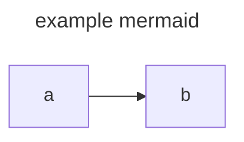

---
name: 'My Cool Post'
slug: 'my-cool-post'
description: 'This is my first and cool post ...'
category: ['Posts/Cool', 'Memories']
tags: ['javascript', 'python']
status: 'draft'
---

# Just testing

I'm trying out GITHub as repository for my Blog posts.

